# Parallel Programming Using Pthreads and OpenMP

## Project Overview

This project demonstrates multithreaded and parallel programming using **POSIX Threads (Pthreads)** and **OpenMP**. It covers thread creation, parallel computation, race conditions, synchronization techniques, and performance comparison with sequential execution.

The project is divided into three parts:

- **Part A — Pthreads**
- **Part B — OpenMP**
- **Part C — Performance Comparison**

---

## Objectives

- Understand thread creation and execution using Pthreads.
- Understand parallel programming using OpenMP.
- Implement parallel summation.
- Demonstrate race conditions.
- Solve race conditions using mutexes and critical sections.
- Understand barrier synchronization.
- Compare sequential, Pthreads, and OpenMP execution times.
- Calculate and analyze parallel speedup.

---

## Tools and Technologies

- **C Programming**
- **POSIX Threads (Pthreads)**
- **OpenMP**
- **GCC Compiler**
- **Git and GitHub**
- **Linux / WSL environment**

---

## Project Structure

```text
PGC-2Multithreaded-Programming-Pthreads-OpenMP/
│
├── Part-A-Pthreads/
│   ├── mutex.c
│   ├── race.c
│   ├── thread1.c
│   ├── thread2.c
│   └── thread_sum.c
│
├── Part-B-OpenMP/
│   ├── omp1.c
│   ├── omp_barrier.c
│   ├── omp_critical.c
│   ├── omp_race.c
│   └── omp_sum.c
│
├── Part-C-Performance/
│   ├── results/
│   ├── omp_perf.c
│   ├── pthread_perf.c
│   └── sequential.c
│
├── screenshots/
│   ├── OpenMP/
│   ├── Performance/
│   └── Pthreads/
│
├── .gitignore
└── README.md
```

---

# Part A — Pthreads

Pthreads, or POSIX Threads, is a standard C library interface used to create and manage multiple threads within a process.

## 1. Thread Creation

The `thread1.c` program demonstrates the basic creation and execution of a thread.

**Source:** [thread1.c](Part-A-Pthreads/thread1.c)

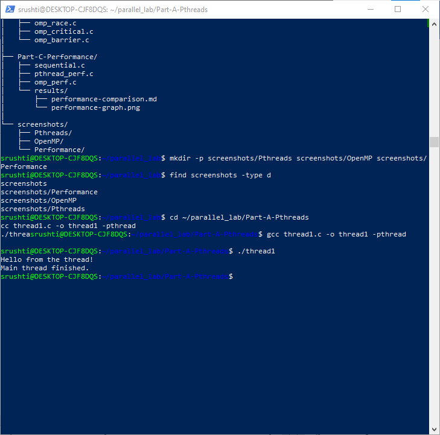

---

## 2. Multiple Thread Creation

The `thread2.c` program demonstrates the creation and execution of multiple threads.

**Source:** [thread2.c](Part-A-Pthreads/thread2.c)

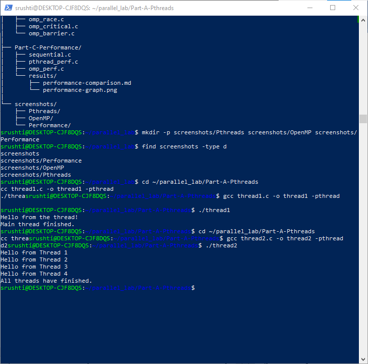

---

## 3. Parallel Sum

The `thread_sum.c` program demonstrates parallel computation of a sum using multiple Pthreads.

**Source:** [thread_sum.c](Part-A-Pthreads/thread_sum.c)

### Output

```text
Parallel Sum = 360
```

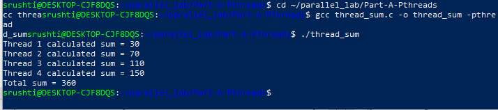

---

## 4. Race Condition

A race condition occurs when multiple threads access and modify shared data at the same time without proper synchronization.

**Source:** [race.c](Part-A-Pthreads/race.c)

### Output

```text
Actual value = 297428
Expected value = 400000
```

The difference between the actual and expected values demonstrates the effect of unsynchronized concurrent access.

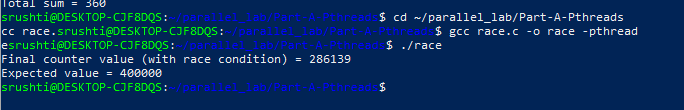

---

## 5. Mutex Synchronization

A mutex provides mutual exclusion so that only one thread can access a protected critical section at a time.

**Source:** [mutex.c](Part-A-Pthreads/mutex.c)

### Output

```text
Actual value = 400000
Expected value = 400000
```

The matching values show that mutex synchronization prevents the race condition.

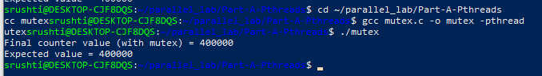

---

# Part B — OpenMP

OpenMP provides compiler directives and runtime functions for shared-memory parallel programming in C, C++, and Fortran.

## 1. Basic OpenMP Threads

The `omp1.c` program demonstrates basic thread creation and execution using OpenMP.

**Source:** [omp1.c](Part-B-OpenMP/omp1.c)

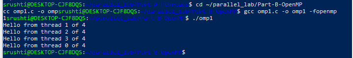

---

## 2. Parallel Sum

The `omp_sum.c` program demonstrates parallel summation using OpenMP.

**Source:** [omp_sum.c](Part-B-OpenMP/omp_sum.c)

### Output

```text
Parallel Sum = 360
```

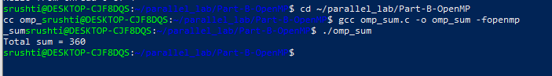

---

## 3. Race Condition

The `omp_race.c` program demonstrates a race condition when multiple OpenMP threads update shared data without synchronization.

**Source:** [omp_race.c](Part-B-OpenMP/omp_race.c)

### Output

```text
Actual value = 240710
Expected value = 400000
```

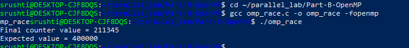

---

## 4. Critical Section

The `omp_critical.c` program uses the OpenMP `critical` directive to protect a shared section of code.

**Source:** [omp_critical.c](Part-B-OpenMP/omp_critical.c)

### Output

```text
Actual value = 400000
Expected value = 400000
```

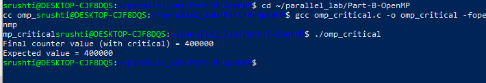

---

## 5. Barrier Synchronization

The `omp_barrier.c` program demonstrates barrier synchronization. A barrier makes threads wait until all participating threads reach the synchronization point.

**Source:** [omp_barrier.c](Part-B-OpenMP/omp_barrier.c)

### Output

```text
Stage 1 completed
Stage 2 completed
```

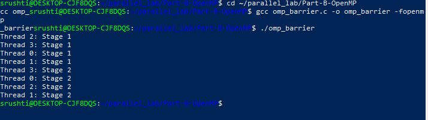

---

# Part C — Performance Comparison

This section compares the execution time of:

1. Sequential execution
2. Pthreads execution
3. OpenMP execution

The same computational task was used to compare the approaches.

---

## Sequential Execution

**Source:** [sequential.c](Part-C-Performance/sequential.c)

### Result

```text
Result = 499999999500.00
Execution time = 5.815207 seconds
```

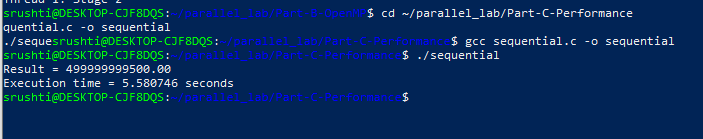

---

## Pthreads Performance

**Source:** [pthread_perf.c](Part-C-Performance/pthread_perf.c)

All executions produced:

```text
499999999500.00
```

| Threads | Execution Time (seconds) |
|--------:|-------------------------:|
| 1 | 5.760953 |
| 2 | 8.462575 |
| 4 | 7.251828 |
| 6 | 4.956253 |
| 16 | 2.507743 |

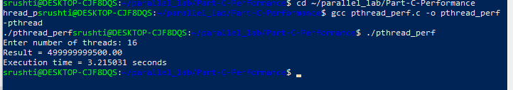

---

## OpenMP Performance

**Source:** [omp_perf.c](Part-C-Performance/omp_perf.c)

All executions produced:

```text
499999999500.00
```

| Threads | Execution Time (seconds) |
|--------:|-------------------------:|
| 1 | 6.274961 |
| 2 | 2.805272 |
| 4 | 1.656242 |
| 6 | 1.784442 |
| 14 | 1.721868 |
| 16 | 1.979686 |

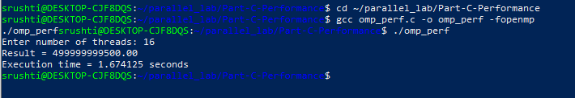

---

## Performance Graph

The performance graph compares the execution times of sequential, Pthreads, and OpenMP implementations.

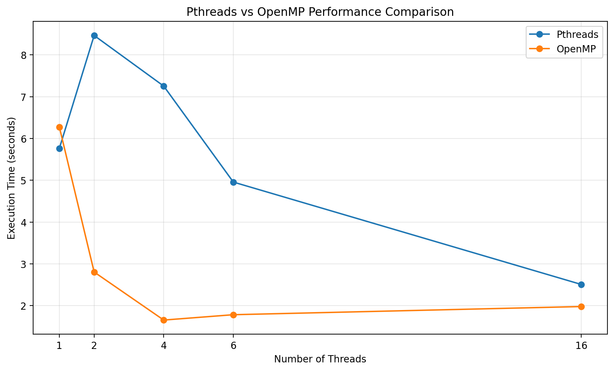

**Performance results:** [performance-comparison.md](Part-C-Performance/results/performance-comparison.md)

---

# Pthreads vs OpenMP Comparison

| Feature | Pthreads | OpenMP |
|---|---|---|
| Thread creation | Explicit using `pthread_create()` | Compiler directives such as `#pragma omp parallel` |
| Thread management | Programmer controlled | Runtime managed |
| Synchronization | Mutexes and other pthread mechanisms | Critical sections, barriers, locks, etc. |
| Programming complexity | More manual control | Generally simpler for parallel loops |
| Parallelism model | Explicit threading | Directive-based shared-memory parallelism |
| Ease of use | More detailed thread management | Easier to implement many parallel tasks |

---

# Speedup Comparison

Speedup is calculated using:

```text
Speedup = Sequential Execution Time / Parallel Execution Time
```

Sequential baseline:

```text
5.815207 seconds
```

## Pthreads Speedup

| Threads | Execution Time (seconds) | Speedup |
|--------:|-------------------------:|--------:|
| 1 | 5.760953 | 1.01× |
| 2 | 8.462575 | 0.69× |
| 4 | 7.251828 | 0.80× |
| 6 | 4.956253 | 1.17× |
| 16 | 2.507743 | 2.32× |

## OpenMP Speedup

| Threads | Execution Time (seconds) | Speedup |
|--------:|-------------------------:|--------:|
| 1 | 6.274961 | 0.93× |
| 2 | 2.805272 | 2.07× |
| 4 | 1.656242 | 3.51× |
| 6 | 1.784442 | 3.26× |
| 14 | 1.721868 | 3.38× |
| 16 | 1.979686 | 2.94× |

---

# Key Observations

- Pthreads provides explicit control over thread creation and synchronization.
- OpenMP simplifies shared-memory parallel programming through compiler directives.
- Race conditions can produce incorrect results when shared data is accessed concurrently without synchronization.
- Mutexes can protect shared data in Pthreads programs.
- OpenMP `critical` sections can protect shared operations.
- Barriers allow threads to synchronize at specific stages.
- Increasing the number of threads does not always reduce execution time because thread creation, scheduling, synchronization, and hardware limitations introduce overhead.
- The recorded performance results show different execution times for different thread counts.

---

# Compilation Summary

## Pthreads

A typical Pthreads program can be compiled using:

```bash
gcc program.c -o program -pthread
```

Example:

```bash
gcc thread1.c -o thread1 -pthread
```

## OpenMP

An OpenMP program can be compiled using:

```bash
gcc program.c -o program -fopenmp
```

Example:

```bash
gcc omp1.c -o omp1 -fopenmp
```

---

# Screenshots

## Pthreads

### Thread Creation


### Multiple Thread Creation


### Parallel Sum


### Race Condition


### Mutex


---

## OpenMP

### Basic OpenMP Threads


### Parallel Sum


### Race Condition


### Critical Section


### Barrier


---

## Performance

### Sequential


### Pthreads


### OpenMP


---

# Source Files

## Pthreads

- [thread1.c](Part-A-Pthreads/thread1.c)
- [thread2.c](Part-A-Pthreads/thread2.c)
- [thread_sum.c](Part-A-Pthreads/thread_sum.c)
- [race.c](Part-A-Pthreads/race.c)
- [mutex.c](Part-A-Pthreads/mutex.c)

## OpenMP

- [omp1.c](Part-B-OpenMP/omp1.c)
- [omp_sum.c](Part-B-OpenMP/omp_sum.c)
- [omp_race.c](Part-B-OpenMP/omp_race.c)
- [omp_critical.c](Part-B-OpenMP/omp_critical.c)
- [omp_barrier.c](Part-B-OpenMP/omp_barrier.c)

## Performance

- [sequential.c](Part-C-Performance/sequential.c)
- [pthread_perf.c](Part-C-Performance/pthread_perf.c)
- [omp_perf.c](Part-C-Performance/omp_perf.c)
- [performance-comparison.md](Part-C-Performance/results/performance-comparison.md)
- [performance-graph.png](Part-C-Performance/results/performance-graph.png)

---

# Experiment Summary

This experiment demonstrates the fundamentals of multithreaded programming using Pthreads and OpenMP. It covers thread creation, parallel computation, race conditions, synchronization, and performance measurement.

The experiment also shows that parallel execution performance depends on the number of threads and the overhead associated with managing concurrent execution.

---

# Conclusion

The project demonstrates how Pthreads and OpenMP can be used to implement shared-memory parallel programs in C. Race conditions were observed in unsynchronized programs and corrected using synchronization mechanisms such as mutexes and critical sections. Barrier synchronization was also demonstrated using OpenMP.

Finally, sequential, Pthreads, and OpenMP implementations were compared using execution time and speedup measurements, providing practical insight into multithreaded performance.
